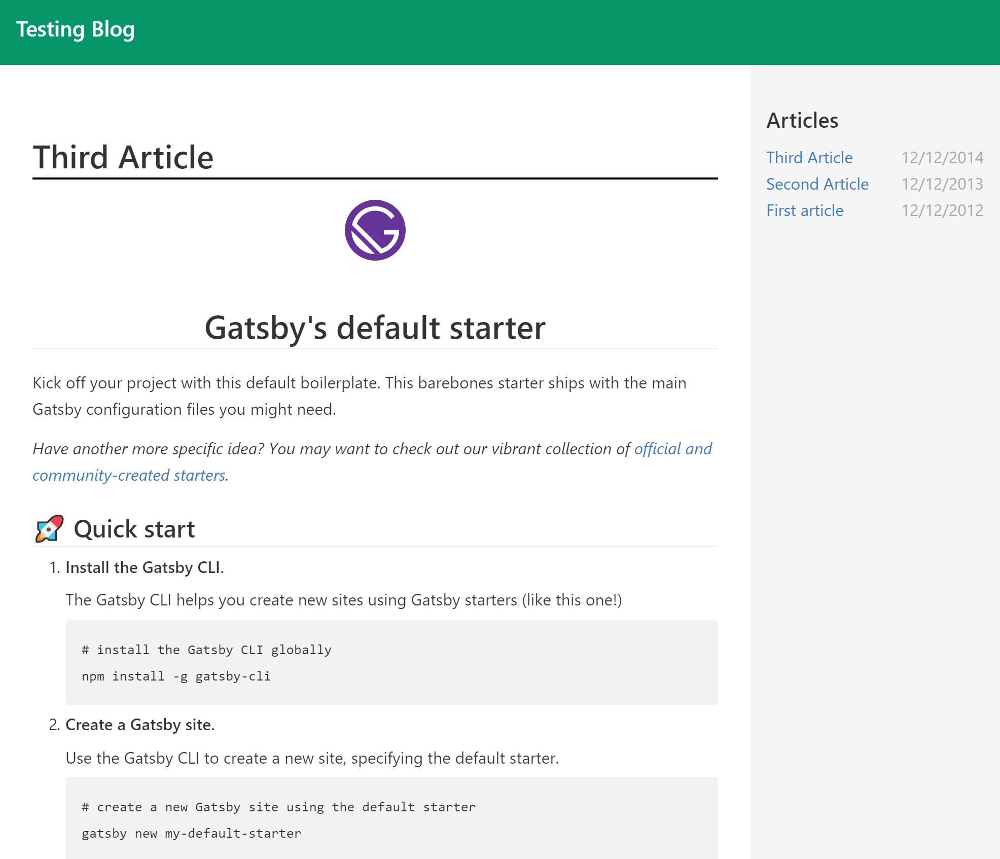

# Gatsby Blog

This is a test repository, made to learn Gatsby. It's not intended as real world scenario but a exploraiton
of Gatsby inner workings and plugins. Maybe it can serve to others as an example of how to use fragment queries,
or how to made a simple markdown blog as well.

# Features

This is just a starting project, but some of the functionalities tested here includes:
- How to read markdown files.
- How to create custom nodes and pages.
- How to use [Typography.js](https://github.com/kyleamathews/typography.js)
- How to customize a typography js plugin.
- How to create custom components and use grament queries.
- How to limit the amount of elements on a query.
- How to add custom images to blog posts.